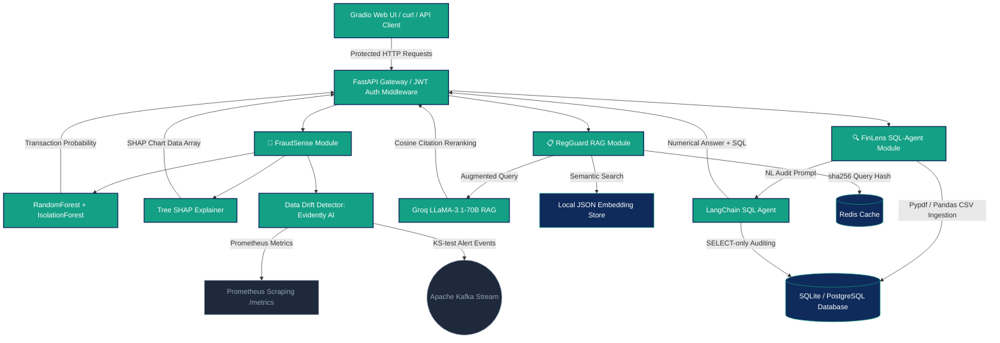

# Artha AI — Production-Grade FinTech AI Platform

Artha AI is a highly sophisticated, production-grade FinTech intelligence and observability platform engineered to showcase event-streaming architecture, advanced ML classification explainability, and real-time MLOps data drift auditing.

This project was built to establish an elite system-level engineering profile for JPMC GCC and Tier-1 Artificial Intelligence labs.

---

## 🏛 Production Architecture

The platform consists of three primary intelligent modules unified under a high-throughput **FastAPI Gateway** with robust **JWT Bearer Token Security**, mounted with an interactive **Gradio UI Dashboard** at the root path (`/`).



---

## 🛠 System-Level Feature Overview

### 1. 🧠 FraudSense (Prediction & Explainability)
*   **Ensemble ML Classifier**: Combines supervised learning (`RandomForestClassifier`) for fraud signature matching with unsupervised anomaly detection (`IsolationForest`).
*   **Tree SHAP Rationales**: Computes real-time **Tree SHAP feature attributions** (`shap.TreeExplainer`) to explain *exactly* why a transaction was flagged, outputting structured `shap_chart_data` (features/values arrays) ready for dynamic front-end bar chart rendering.
*   **Auto-Training Startup Thread**: Automatically detects if the model file is missing at server startup and triggers synthetic transaction data training in a background daemon thread, returning HTTP 503 (with `Retry-After: 30`) to API requests until complete.

### 2. 📋 RegGuard (Regulatory Auditing RAG)
*   **Indian Compliance Corpus**: Ingests custom regulatory guidelines (SEBI KYC Circulars, NPCI UPI 2.0 daily limits, FEMA LRS outward remittance caps, and PMLA cash reporting thresholds).
*   **Groq LLaMA-3.1-70B RAG**: Augmented query pipeline executing online RAG on Groq's high-throughput LLM, falling back gracefully to offline local template generation if keys are missing.
*   **Cosine-Similarity Citation Reranking**: Performs post-hoc semantic similarity ranking of retrieved chunks against generated responses to guarantee cited paragraph credibility and calculate a mathematical **Confidence Index**.
*   **Redis Caching**: Caches compliance answers per sha256 query hash (TTL 1h) to save API tokens and speed up recurring audits.

### 3. 🔍 FinLens (Statement Conversational SQL-Agent)
*   **Pandas CSV Normalization**: Supports digital CSV statement uploads with column normalisation mapping varied formats (`Cr`/`Dr`, `Credit`/`Debit`, `+`/`-`) to canonical transaction directions.
*   **LangChain SQL Database Agent**: Leverages a stateful LangChain agent with a Groq LLaMA-3.1-8b-instant backend to translate natural language financial audits directly into secure, SELECT-only SQL queries, completely eliminating math hallucinations.
*   **Offline Keyword Router**: Features an offline fallback path with a 15+ pattern matching keyword routing compiler to ensure operational continuity in air-gapped environments.

### 4. 📈 MLOps & Observability
*   **Statistical Data Drift (Evidently AI)**: Computes two-sample Kolmogorov-Smirnov statistical tests using Evidently AI's `Report([DataDriftPreset()])` comparing sliding transaction windows to a reference CSV baseline (`data/baseline_transactions.csv`).
*   **Kafka Drift Alerting**: Publishes real-time alert event payloads to Kafka topic `artha.monitoring.drift` when feature drift index (1 - p-value) exceeds `0.6`.
*   **Prometheus Expositions**: Exposes metrics (scoring latency histograms, transaction counts, and drift indices) under standard scrapable `/metrics` endpoints.

---

## 🔒 Security Baseline
*   **JWT Bearer Authentication**: Secures all analytical and transactional API endpoints under role-based authorization headers (`admin`, `analyst`, `readonly`), returning standard HTTP 401 on missing or expired tokens.
*   **Secrets Validation**: Enforces safety settings by validating `SECRET_KEY` length (minimum 32 characters) on startup and raising fatal `ValueError` if production keys are missing.
*   **Embeddings Integrity (JSON + CRC32)**: Replaced insecure pickle serialization in the vector database with standardized JSON storing vector coordinates and validated by a CRC32 checksum.
*   **JWT Dynamic Key Rotation**: Admin-only `/auth/rotate-key` endpoint that dynamically rotates the in-memory signing key, invalidating all outstanding tokens immediately.

---

## 🚀 How to Run Locally

### Option A: Docker Compose Orchestration (All Services)
Launch the entire network (FastAPI Gateway, PostgreSQL with pgvector, Redis Cache, Apache Kafka, Zookeeper) with one command:
```bash
docker compose up --build
```

### Option B: Bare-Metal Launcher (`deploy_local.sh`)
```bash
chmod +x deploy_local.sh

# Run Dev Server (FastAPI locally with hot reload, DBs in Docker containers)
./deploy_local.sh --dev

# Run Offline Server (no Docker required; runs on SQLite + thread-safe local mocks)
./deploy_local.sh --offline
```

---

## 👨‍💻 Author
**GAURAV KUMAR NAYAK**
*   **Email:** gauravnayak711@gmail.com
*   **GitHub:** [github.com/Gaurav711cgu](https://github.com/Gaurav711cgu)
*   **Portfolio:** [gaurav-portfolio-iycu.vercel.app](https://gaurav-portfolio-iycu.vercel.app/)
