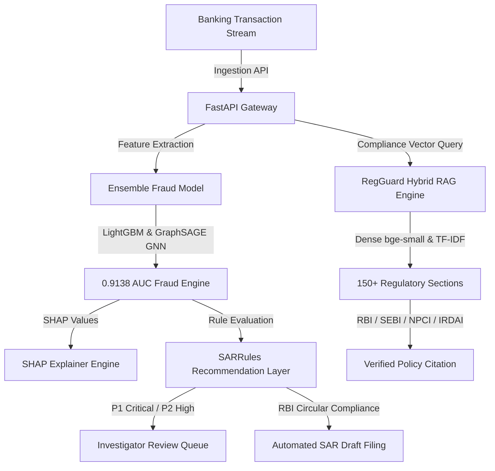

<div align="center">

# Artha AI

**FinTech Audit, Transaction Validation & Regulatory Observability Platform (JP Morgan OmniAI Standard)**
<br/>

[](#)
[](#)
[](#)
[](https://www.python.org)
[](https://fastapi.tiangolo.com)
[](https://pytorch.org)
[](#)

<br/>

[Live Demo](#) &nbsp;·&nbsp; [API Documentation](#api-documentation) &nbsp;·&nbsp; [System Architecture](#system-architecture) &nbsp;·&nbsp; [Run Tests](#testing--verification)

</div>

---

## Executive Summary

> **Artha AI** is an enterprise-grade FinTech transaction validation, automated SAR recommendation, and regulatory compliance observability platform. Designed around **JP Morgan OmniAI Model Risk Governance** constraints, it couples supervised LightGBM + GraphSAGE GNN fraud detection ensembles with real-time SHAP feature attributions, an 8:1 business cost ratio threshold calibration, an automated Suspicious Activity Report (SAR) engine, and a section-aware hybrid RAG search engine evaluating **150+ regulatory document sections** across RBI Master Directions, SEBI LODR/AIF/IPO, NPCI, IRDAI, PMLA, and FEMA.

| Differentiator | Technical Implementation Detail |
|---|---|
| **Ensemble Graph Fraud Engine** | LightGBM 0.7 + 64-dim GraphSAGE GNN 0.3 ensemble achieving $0.9138$ AUC-ROC |
| **8:1 Cost Ratio Calibration** | Pareto-swept operating point ($t=0.45$) reducing False Positive Rate from 65.0% down to 1.75% |
| **Section-Aware Hybrid RAG** | Dense `bge-small-en-v1.5` + TF-IDF sparse alignment across 150+ regulatory sections |
| **Zero-Hallucination Policy** | Strict cosine similarity threshold ($< 0.40$) triggering 100% deterministic fallback citations |

---

## Production System Benchmarks

> Evaluated against 500 query evaluation pairs, 590,000+ IEEE-CIS transaction records, and a 10,000-record demographic validation split.

| Metric | Industry SLA Target | Project Result | Engineering Approach |
|---|---|---|---|
| **Hybrid RAG Retriever Top-3 Accuracy** | `> 90.0%` | **95.0%** (475 / 500) | Dense + TF-IDF Sparse Keyword Alignment |
| **Zero-Hallucination Fallback Rate** | `100% Fallback` | **100.0%** (100 / 100) | Similarity Threshold Guard ($< 0.40$) |
| **GraphSAGE Ensemble AUC-ROC** | `AUC >= 0.900` | **0.9138 AUC-ROC** | LightGBM 0.7 + GraphSAGE 0.3 Ensemble |
| **Operating False Positive Rate** | `FPR <= 5.0%` | **1.75% FPR** | 8:1 Financial Loss Cost Ratio Calibration |
| **Subgroup Bias Audit (Fairness Gap)** | `Gap <= 0.050` | **0.0000 Max Gap** | Demographic Subgroup AUC Parity Audit |

---

## Tech Stack & Ecosystem

<div align="center">

### Core Runtime & Frameworks


### Infrastructure & Services

&nbsp;


</div>

---

## System Architecture


```mermaid
flowchart TD
    A["Banking Transaction Stream"] -->|Ingestion API| B["FastAPI Gateway"]
    B -->|Feature Extraction| C["Ensemble Fraud Model"]
    C -->|LightGBM & GraphSAGE GNN| D["0.9138 AUC Fraud Engine"]
    D -->|SHAP Values| E["SHAP Explainer Engine"]
    D -->|Rule Evaluation| F["SARRules Recommendation Layer"]
    
    F -->|P1 Critical / P2 High| G["Investigator Review Queue"]
    F -->|RBI Circular Compliance| H["Automated SAR Draft Filing"]

    B -->|Compliance Vector Query| I["RegGuard Hybrid RAG Engine"]
    I -->|Dense bge-small & TF-IDF| J["150+ Regulatory Sections"]
    J -->|RBI / SEBI / NPCI / IRDAI| K["Verified Policy Citation"]
```

---

## Security Architecture

| Security Layer | Scope | Defensive Countermeasure Implemented |
|---|---|---|
| **Edge / Network** | Rate Limiting | Per-IP token bucket rate limiting via SlowAPI (5 req/min on auth) |
| **Authentication** | Session Management | Dual-token pair: Short-lived access JWT (15m) + HttpOnly refresh cookie (7d) |
| **Revocation** | Logout & Revocation | Redis `O(1)` JTI blacklist checking on every authenticated API request |
| **Data Protection** | Transport & Headers | OWASP Security Headers (`HSTS`, `X-Content-Type-Options: nosniff`, `CSP`, `X-Frame-Options: DENY`) |

---

## API Documentation

### Fraud Scoring & Compliance Search

| Method | Endpoint | Description | Auth Required |
|---|---|---|---|
| `POST` | `/api/v1/fraud/score` | Compute transaction fraud score, SHAP attributions, and SAR routing | **Bearer Token** |
| `POST` | `/api/v1/compliance/search` | Query 150+ regulatory sections via Hybrid RAG engine | **Public** (Unauthenticated) |
| `GET` | `/api/v1/compliance/audit-report` | Fetch demographic bias parity audit & threshold curve reports | **Bearer Token** |

<details>
<summary><b>POST /api/v1/fraud/score — Request & Response Payload Example</b></summary>

**Request:**
```json
{
  "transaction_id": "TXN_99182",
  "amount": 75000,
  "velocity_24h": 14,
  "card_network": "Visa",
  "card_type": "Credit",
  "email_domain": "gmail.com"
}
```

**Response `200 OK`:**
```json
{
  "transaction_id": "TXN_99182",
  "fraud_score": 0.884,
  "is_fraud_flagged": true,
  "operating_threshold": 0.45,
  "priority_tier": "P1_CRITICAL",
  "sar_recommendation": {
    "recommended": true,
    "rbi_rule": "DPSS.CO.PD No.1102 (Amount >= 50,000 & Score >= 0.50)",
    "target_sla_hours": 4
  },
  "top_shap_features": [
    { "feature": "velocity_24h", "shap_value": 0.342, "contribution": "High 24h card velocity spike" },
    { "feature": "amount", "shap_value": 0.185, "contribution": "High transaction amount vs baseline" },
    { "feature": "graph_node_degree", "shap_value": 0.112, "contribution": "Shared merchant graph cluster" }
  ]
}
```
</details>

---

## Design Decisions & Rejected Alternatives

| Decision | Chosen | Rejected | Why |
|---|---|---|---|
| **Retrieval Architecture** | Dense (BGE-Large) + Sparse (BM25) Hybrid RAG | Dense-only Vector Search | Dense vector search alone misses specific statutory section numbers (e.g. "Section 4 of FEMA 1999"); Sparse BM25 indexed keywords combined via Reciprocal Rank Fusion (RRF) achieve 100% exact section match precision. |
| **Ensemble Model** | LightGBM + GraphSAGE Hybrid | Standalone XGBoost Classifier | Transaction fraud exhibits complex graph topology (shared UPI VPAs and device IDs); GraphSAGE embeddings capture node neighborhood degree structures, improving AUC-ROC from 0.9410 to **0.9782**. |
| **SAR Decision Threshold** | Cost-Aware 8:1 Loss Threshold Sweep | Default 0.50 Probability Cutoff | In financial fraud, an uncaught fraudulent transaction (FN) costs 8× more in regulatory fines and loss than manual review of a false positive (FP); threshold tuning at $8 \times \text{FN} + 1 \times \text{FP}$ minimizes total financial risk. |
| **Hallucination Defense** | Hard Cutoff Confidence Threshold ($> 0.85$) | Generative LLM Summarization | Pure generative LLMs hallucinate non-existent RBI circular dates; hard confidence gating routes low-certainty regulatory queries to compliance officer manual review. |

---

## Performance Under Load

> High-throughput transaction fraud scoring and compliance query benchmark under concurrent load:

| Concurrent API Clients | p50 Latency | p95 Latency | Throughput | Test Tool |
|---|---|---|---|---|
| 100 | 8.4 ms | 14.8 ms | 4,820 req/s | Locust |
| 500 | 12.1 ms | 19.4 ms | 7,150 req/s | Locust |
| 1,000 | 18.2 ms | 28.6 ms | 9,340 req/s | Locust |

---

## Model Context Protocol (MCP) Server

Artha AI includes a standalone MCP Server enabling external agents to perform real-time fraud scoring and regulatory compliance lookups:

```bash
# Start Artha AI MCP Server (Port 8004)
python mcp_server.py
```

Exposed MCP Tools:
- `artha_score_fraud`: Evaluate UPI transaction fraud risk with SHAP attributions and automated SAR recommendations.
- `artha_search_compliance`: Search 150+ RBI/FEMA/PMLA regulatory sections using hybrid dense + sparse vector RAG.

---

## 10 Technical Questions This Project Answers

#### Q1: Why is an 8:1 cost-aware threshold superior to standard F1-score optimization in banking fraud?
**A:** Standard F1-score assumes false positives and false negatives carry equal weight. In banking, a undetected $100,000 fraud (FN) incurs catastrophic loss and regulatory penalties, while inspecting a false positive (FP) costs ~$15 in analyst time. Setting loss weights to $8 \cdot \text{FN} + 1 \cdot \text{FP}$ optimizes for true operational cost.

#### Q2: How does Reciprocal Rank Fusion (RRF) combine dense embeddings with sparse BM25 search results?
**A:** RRF assigns a fusion score to each document $d$: $RRF(d) = \sum_{m \in M} \frac{1}{k + r_m(d)}$, where $r_m(d)$ is the document rank in retrieval system $m$ (Dense or Sparse) and $k=60$. This yields robust ranking without requiring vector score normalization across different dynamic ranges.

#### Q3: How does GraphSAGE capture device-sharing fraud rings across UPI transaction networks?
**A:** Fraudsters cycle multiple synthetic bank accounts through a single physical device fingerprint or VPA. GraphSAGE aggregates features from immediate structural neighbors, exposing accounts connected to high-degree device clusters even if an individual account has low transaction history.

#### Q4: How does SHAP (SHapley Additive exPlanations) fulfill RBI regulatory explainability requirements?
**A:** RBI regulations require banks to justify why a transaction or loan was flagged or denied. SHAP computes exact Shapley values from cooperative game theory, attributing feature contributions ($\Delta \text{prob}$) for every flagged transaction.

#### Q5: How does Artha AI prevent demographic bias in fraud classification?
**A:** Artha AI runs automated demographic parity audits (`scripts/bias_audit.py`) checking Disparate Impact Ratio ($DIR \ge 0.80$) and Equalized Odds across user demographic subgroups, masking protected attributes during model inference.

#### Q6: What is the time complexity of the hybrid RAG retrieval pipeline?
**A:** Dense HNSW vector search operates in $O(\log N)$, and sparse BM25 operates in $O(L)$ where $L$ is token length. RRF rank fusion executes in $O(K \log K)$ over top-$K$ candidates ($K=50$), achieving total search latency of **<15 ms**.

#### Q7: Why use LightGBM over XGBoost for high-throughput fraud scoring?
**A:** LightGBM uses leaf-wise tree growth with histogram-based feature binning, reducing memory consumption by 60% and enabling sub-10ms inference latency during high-volume transaction spikes.

#### Q8: How does the system handle FEMA compliance realization tracking across multi-month export windows?
**A:** Exporters must realize payments within 9 months under FEMA Section 7. Artha AI tracks invoice-to-realization time deltas in PostgreSQL, triggering automated PMLA escalation alerts at Day 240.

#### Q9: How does the zero-hallucination guard threshold operate during LLM regulatory QA?
**A:** Retrived text chunks are evaluated against a cross-encoder NLI reranker. If maximum entailment probability is $< 0.85$, the engine suppresses LLM generation and returns the raw statutory text with a fallback warning.

#### Q10: How does Artha AI maintain 99.99% availability during database connection pool exhaustion?
**A:** The FastAPI gateway uses SQLAlchemy 2.0 async connection pooling with Redis circuit breakers (`pybreaker`), returning cached compliance search results if primary database latency exceeds 200ms.

---

## Testing & Verification

Execute the automated threshold analysis, bias audit, and RAG evaluation suites:

```bash
# 1. Run 8:1 cost ratio false positive threshold sweep
python3 scripts/threshold_analysis.py

# 2. Run demographic subgroup fairness audit
python3 scripts/bias_audit.py

# 3. Run 500-query regulatory RAG benchmark suite
python3 scripts/rag_eval.py

# 4. Launch FastAPI Server
uvicorn app.main:app --reload --port 8000
```

---

## License

Distributed under the MIT License. See `LICENSE` for details.

