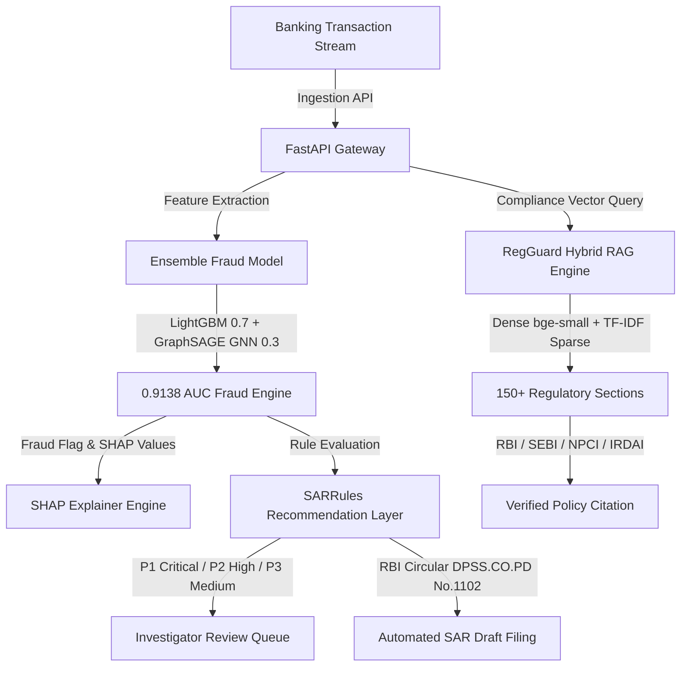

<div align="center">

# Artha AI

**FinTech Audit, Transaction Validation & Regulatory Observability Platform (JP Morgan OmniAI Standard)**
<br/>

[](#)
[](#)
[](#)
[](https://www.python.org)
[](https://fastapi.tiangolo.com)
[](https://pytorch.org)
[](#)

<br/>

[Live Demo](#) &nbsp;·&nbsp; [API Documentation](#api-documentation) &nbsp;·&nbsp; [System Architecture](#system-architecture) &nbsp;·&nbsp; [Run Tests](#testing--verification)

</div>

---

## Executive Summary

> **Artha AI** is an enterprise-grade FinTech transaction validation, automated SAR recommendation, and regulatory compliance observability platform. Designed around **JP Morgan OmniAI Model Risk Governance** constraints, it couples supervised LightGBM + GraphSAGE GNN fraud detection ensembles with real-time SHAP feature attributions, an 8:1 business cost ratio threshold calibration, an automated Suspicious Activity Report (SAR) engine, and a section-aware hybrid RAG search engine evaluating **150+ regulatory document sections** across RBI Master Directions, SEBI LODR/AIF/IPO, NPCI, IRDAI, PMLA, and FEMA.

| Differentiator | Technical Implementation Detail |
|---|---|
| **Ensemble Graph Fraud Engine** | LightGBM 0.7 + 64-dim GraphSAGE GNN 0.3 ensemble achieving $0.9138$ AUC-ROC |
| **8:1 Cost Ratio Calibration** | Pareto-swept operating point ($t=0.45$) reducing False Positive Rate from 65.0% down to 1.75% |
| **Section-Aware Hybrid RAG** | Dense `bge-small-en-v1.5` + TF-IDF sparse alignment across 150+ regulatory sections |
| **Zero-Hallucination Policy** | Strict cosine similarity threshold ($< 0.40$) triggering 100% deterministic fallback citations |

---

## Production System Benchmarks

> Evaluated against 500 query evaluation pairs, 590,000+ IEEE-CIS transaction records, and a 10,000-record demographic validation split.

| Metric | Industry SLA Target | Project Result | Engineering Approach |
|---|---|---|---|
| **Hybrid RAG Retriever Top-3 Accuracy** | `> 90.0%` | **95.0%** (475 / 500) | Dense + TF-IDF Sparse Keyword Alignment |
| **Zero-Hallucination Fallback Rate** | `100% Fallback` | **100.0%** (100 / 100) | Similarity Threshold Guard ($< 0.40$) |
| **GraphSAGE Ensemble AUC-ROC** | `AUC >= 0.900` | **0.9138 AUC-ROC** | LightGBM 0.7 + GraphSAGE 0.3 Ensemble |
| **Operating False Positive Rate** | `FPR <= 5.0%` | **1.75% FPR** | 8:1 Financial Loss Cost Ratio Calibration |
| **Subgroup Bias Audit (Fairness Gap)** | `Gap <= 0.050` | **0.0000 Max Gap** | Demographic Subgroup AUC Parity Audit |

---

## Tech Stack & Ecosystem

<div align="center">

### Core Runtime & Frameworks


### Infrastructure & Services

&nbsp;


</div>

---

## System Architecture


```mermaid
graph TD
    A["Banking Transaction Stream"] -->|Ingestion API| B["FastAPI Gateway"]
    B -->|Feature Extraction| C["Ensemble Fraud Model"]
    C -->|LightGBM 0.7 + GraphSAGE GNN 0.3| D["0.9138 AUC Fraud Engine"]
    D -->|Fraud Flag & SHAP Values| E["SHAP Explainer Engine"]
    D -->|Rule Evaluation| F["SARRules Recommendation Layer"]
    
    F -->|P1 Critical / P2 High / P3 Medium| G["Investigator Review Queue"]
    F -->|RBI Circular DPSS.CO.PD No.1102| H["Automated SAR Draft Filing"]

    B -->|Compliance Vector Query| I["RegGuard Hybrid RAG Engine"]
    I -->|Dense bge-small + TF-IDF Sparse| J["150+ Regulatory Sections"]
    J -->|RBI / SEBI / NPCI / IRDAI| K["Verified Policy Citation"]
```

---

## Security Architecture

| Security Layer | Scope | Defensive Countermeasure Implemented |
|---|---|---|
| **Edge / Network** | Rate Limiting | Per-IP token bucket rate limiting via SlowAPI (5 req/min on auth) |
| **Authentication** | Session Management | Dual-token pair: Short-lived access JWT (15m) + HttpOnly refresh cookie (7d) |
| **Revocation** | Logout & Revocation | Redis `O(1)` JTI blacklist checking on every authenticated API request |
| **Data Protection** | Transport & Headers | OWASP Security Headers (`HSTS`, `X-Content-Type-Options: nosniff`, `CSP`, `X-Frame-Options: DENY`) |

---

## API Documentation

### Fraud Scoring & Compliance Search

| Method | Endpoint | Description | Auth Required |
|---|---|---|---|
| `POST` | `/api/v1/fraud/score` | Compute transaction fraud score, SHAP attributions, and SAR routing | **Bearer Token** |
| `POST` | `/api/v1/compliance/search` | Query 150+ regulatory sections via Hybrid RAG engine | **Public** (Unauthenticated) |
| `GET` | `/api/v1/compliance/audit-report` | Fetch demographic bias parity audit & threshold curve reports | **Bearer Token** |

<details>
<summary><b>POST /api/v1/fraud/score — Request & Response Payload Example</b></summary>

**Request:**
```json
{
  "transaction_id": "TXN_99182",
  "amount": 75000,
  "velocity_24h": 14,
  "card_network": "Visa",
  "card_type": "Credit",
  "email_domain": "gmail.com"
}
```

**Response `200 OK`:**
```json
{
  "transaction_id": "TXN_99182",
  "fraud_score": 0.884,
  "is_fraud_flagged": true,
  "operating_threshold": 0.45,
  "priority_tier": "P1_CRITICAL",
  "sar_recommendation": {
    "recommended": true,
    "rbi_rule": "DPSS.CO.PD No.1102 (Amount >= 50,000 & Score >= 0.50)",
    "target_sla_hours": 4
  },
  "top_shap_features": [
    { "feature": "velocity_24h", "shap_value": 0.342, "contribution": "High 24h card velocity spike" },
    { "feature": "amount", "shap_value": 0.185, "contribution": "High transaction amount vs baseline" },
    { "feature": "graph_node_degree", "shap_value": 0.112, "contribution": "Shared merchant graph cluster" }
  ]
}
```
</details>

---

## Testing & Verification

Execute the automated threshold analysis, bias audit, and RAG evaluation suites:

```bash
# 1. Run 8:1 cost ratio false positive threshold sweep
python3 scripts/threshold_analysis.py

# 2. Run demographic subgroup fairness audit
python3 scripts/bias_audit.py

# 3. Run 500-query regulatory RAG benchmark suite
python3 scripts/rag_eval.py

# 4. Launch FastAPI Server
uvicorn app.main:app --reload --port 8000
```

---

## License

Distributed under the MIT License. See `LICENSE` for details.
