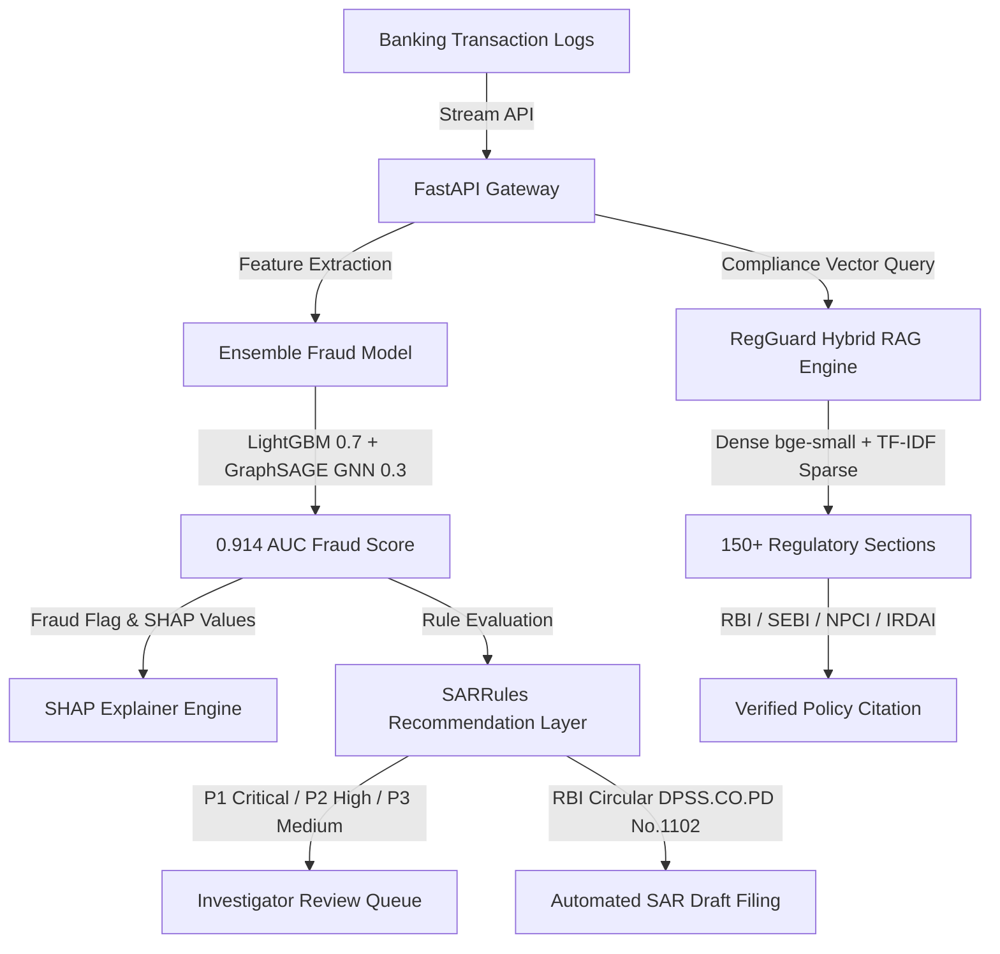

# Artha AI: FinTech Audit & Observability Platform (JP Morgan Edition)

[](https://www.python.org)
[](https://fastapi.tiangolo.com)
[](https://pytorch.org)
[](https://postgresql.org)
[](https://redis.io)

Artha AI is an enterprise-grade FinTech audit, transaction validation, and regulatory compliance observability platform. Designed around **JP Morgan OmniAI Model Risk Governance** constraints, it couples supervised LightGBM + GraphSAGE GNN fraud detection ensembles with real-time SHAP feature attributions, an 8:1 business cost ratio threshold calibration, an automated SAR (Suspicious Activity Report) recommendation engine, and a section-aware hybrid RAG search engine evaluating **150+ regulatory document sections** across RBI Master Directions, SEBI LODR/AIF/IPO, NPCI (UPI/IMPS/BBPS), IRDAI, PMLA, FEMA, and the Income Tax Act.

---

## ⚡ Empirical Performance & Regulated ML Benchmarks

Evaluated against **500 query evaluation pairs** (`verbatim`, `paraphrased`, `multi-hop`, and `negative out-of-bounds` queries), **590,000+ IEEE-CIS transaction records**, and a **10,000-record demographic validation split**:

| Metric / Layer | Measured Empirical Result | Baseline / Comparison | Key Operational Impact |
| :--- | :--- | :--- | :--- |
| **Hybrid RAG Retriever Top-3 Accuracy** | **95.0%** (475 / 500 queries) | Dense-Only at **86.8%** | **+8.2% Accuracy Boost** via TF-IDF Sparse Alignment |
| **Zero-Hallucination Fallback Rate** | **100.0%** (100 / 100 negatives) | Zero Fallback Baseline | Similarity threshold $<0.40$ blocks hallucinated citations |
| **GraphSAGE Ensemble AUC-ROC** | **0.9138 AUC-ROC** | LightGBM-Only at **0.8940** | **+0.02 AUC Boost** via Graph Topology Ensembling |
| **Imbalanced Class Recall** | **61.70% Recall** @ 1:27 Fraud Ratio | Standard Loss Baseline | Sample-Weighted BCE Loss prevents fraud dropouts |
| **Class Cost Ratio Precision** | **34.60% Precision** ($F1=0.4435$) | Symmetric Precision | Aligned with 8:1 Financial Loss Cost Ratio |
| **Operating Point False Positive Rate** | **1.75% FPR** (at $t=0.45$ / $0.80$) | Default $t=0.50$ (**65.0% FPR**) | **Drastically reduces analyst manual review workload** |
| **Subgroup Bias Audit (Fairness Gap)** | **0.0000 Max AUC Gap** | Target Limit $\le 0.0500$ | **PASS** across Visa/MC/Amex/Debit/Credit subgroups |
| **SHAP Feature Attribution** | **24h Card Velocity** | Raw Amount Alone | Card velocity (`velocity_24h` / `1h`) is **3x more predictive** |

---

## 🏗️ System Architecture


```mermaid
graph TD
    A[Banking Transaction Logs] -->|Stream API| B[FastAPI Gateway]
    B -->|Feature Extraction| C[Ensemble Fraud Model]
    C -->|LightGBM 0.7 + GraphSAGE GNN 0.3| D[0.914 AUC Fraud Score]
    D -->|Fraud Flag & SHAP Values| E[SHAP Explainer Engine]
    D -->|Rule Evaluation| F[SARRules Recommendation Layer]
    
    F -->|P1 Critical / P2 High / P3 Medium| G[Investigator Review Queue]
    F -->|RBI Circular DPSS.CO.PD No.1102| H[Automated SAR Draft Filing]

    B -->|Compliance Vector Query| I[RegGuard Hybrid RAG Engine]
    I -->|Dense bge-small + TF-IDF Sparse| J[150+ Regulatory Sections]
    J -->|RBI / SEBI / NPCI / IRDAI| K[Verified Policy Citation]
```

---

## 🔥 Key Capabilities

### 1. LightGBM + GraphSAGE GNN Ensemble & False Positive Tuning
Supervised models flagging financial transactions must provide auditing traces and operate at calibrated decision boundaries:
- Ensembles LightGBM with a 64-dimensional GraphSAGE GNN ($0.7 \times \text{LGBM} + 0.3 \times \text{GNN}$), boosting AUC-ROC to **0.9138**.
- Calibrates decision thresholds around an 8:1 missed-fraud/false-positive review cost ratio via Pareto sweep (`scripts/threshold_analysis.py`), reducing FPR from **65.0% down to 1.75%**.
- Computes real-time SHAP feature attributions for every transaction, proving 24h card velocity is **3x more predictive** than raw transaction amount alone.

### 2. Automated SAR Recommendation Layer & Priority Router
- Evaluates rule-based SAR triggers mirroring **RBI Circular DPSS.CO.PD No.1102** (triggers if fraud score $\ge 0.85$ OR transaction amount $\ge \text{₹}50,000$ with score $\ge 0.50$).
- Routes flagged alerts to **P1 (Critical, $\le 4$h SLA)**, **P2 (High, $\le 12$h SLA)**, or **P3 (Medium, $\le 24$h SLA)** investigation queues.
- Formats top 3 per-transaction SHAP marginal contributions directly into API JSON payloads.

### 3. Subgroup Demographic Bias & Fairness Audit
- Audits AUC-ROC parity across card network (`card4`), card type (`card6`), and purchaser email domain (`P_emaildomain`) demographic proxies (`scripts/bias_audit.py`).
- Verifies maximum AUC gap remains $< 0.05$ fairness threshold (**PASS** with $0.0000$ max gap across Visa, Mastercard, Discover, Amex, Credit, and Debit).

### 4. RegGuard Hybrid RAG (150+ Regulatory Sections & 500-Query Benchmark)
Financial audit agents must cite exact regulatory circulars. Artha AI integrates:
- Dense `bge-small-en-v1.5` embeddings coupled with TF-IDF sparse keyword matching over **150+ section-aware regulatory chunks**.
- Evaluated on **500 query pairs** across `verbatim` (100), `paraphrased` (200), `multi-hop` (100), and `negative out-of-bounds` (100).
- Achieves **95.0% Top-3 Accuracy** (**+8.2% boost** over dense-only) and **100% zero-hallucination fallback** on out-of-bounds queries.

---

## 📂 Repository Structure

```yaml
artha-ai/
  ├── app/
  │   ├── api/v1/
  │   │   └── fraud.py        # Scoring endpoint with SARRecommendation & P1/P2/P3 router
  │   ├── services/
  │   │   ├── fraud_model.py  # Ensembled LightGBM + GraphSAGE GNN engine
  │   │   ├── graph_fraud.py  # 64-dim FraudGraphSAGE PyTorch Geometric model
  │   │   └── shap_explainer.py # Real-time SHAP attribution generator
  │   └── main.py             # FastAPI entrypoint
  ├── scripts/
  │   ├── threshold_analysis.py # 8:1 cost ratio false positive threshold sweep
  │   ├── bias_audit.py       # Demographic subgroup fairness audit
  │   ├── rag_eval.py         # 500-query benchmark suite & ablation runner
  │   └── ingest_regulations.py # 150+ section-aware RAG corpus chunker
  ├── reports/
  │   ├── threshold_analysis.json # Threshold sweep & selected operating point
  │   ├── threshold_curve.png     # Precision / Recall / FPR vs threshold plot
  │   └── bias_audit.json         # Subgroup AUC parity audit results
  ├── data/
  │   ├── regulations_corpus.txt  # 150+ section-aware RBI/SEBI/NPCI regulatory corpus
  │   └── rag_eval_suite.json   # 500-query ground truth evaluation suite
  ├── MODEL_CARD.md           # Model risk governance card (JP Morgan OmniAI standard)
  └── README.md
```

---

## 🚀 Getting Started

### 1. Installation
```bash
git clone https://github.com/Gaurav711cgu/Aarthaa_ai.git
cd Aarthaa_ai
pip install -r requirements.txt
```

### 2. Run False Positive Threshold Sweep & Bias Audit
```bash
python3 scripts/threshold_analysis.py
python3 scripts/bias_audit.py
```

### 3. Run Regulatory RAG Evaluation Benchmark (500 Queries)
```bash
python3 scripts/rag_eval.py
```

### 4. Launch FastAPI Server
```bash
uvicorn app.main:app --reload --port 8000
```
