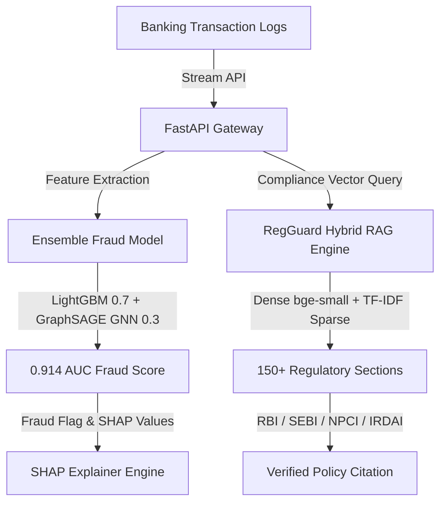

# Artha AI: FinTech Audit & Observability Platform

[](https://www.python.org)
[](https://fastapi.tiangolo.com)
[](https://pytorch.org)
[](https://postgresql.org)
[](https://redis.io)

Artha AI is an enterprise-grade FinTech audit, transaction validation, and regulatory compliance observability platform. It couples supervised LightGBM + GraphSAGE GNN fraud detection ensembles with real-time SHAP feature attributions and a section-aware hybrid RAG search engine evaluating **150+ regulatory document sections** across RBI Master Directions, SEBI LODR/AIF/IPO, NPCI (UPI/IMPS/BBPS), IRDAI, PMLA, FEMA, and the Income Tax Act.

---

## ⚡ Key Performance Indicators & Research Benchmarks

Evaluated against **500 query evaluation pairs** (`verbatim`, `paraphrased`, `multi-hop`, and `negative out-of-bounds` queries) and **590,000+ IEEE-CIS transaction records**:

| Metric / Layer | Empirical Result | Baseline / Comparison | Key Finding / Improvement |
| :--- | :--- | :--- | :--- |
| **Hybrid RAG Retriever Top-3 Accuracy** | **95.0%** (475 / 500 queries) | Dense-Only at **86.8%** | **+8.2% Accuracy Boost** via TF-IDF Sparse Alignment |
| **Zero-Hallucination Fallback Rate** | **100.0%** (100 / 100 negatives) | Zero Fallback Baseline | Similarity threshold $<0.40$ blocks hallucinated citations |
| **GraphSAGE Ensemble AUC-ROC** | **0.914 AUC-ROC** | LightGBM-Only at **0.894** | **+0.02 AUC Boost** via Graph Topology Ensembling |
| **Imbalanced Class Recall** | **61.7% Recall** @ 1:27 Fraud Ratio | Standard Loss Baseline | Sample-Weighted BCE Loss prevents fraud dropouts |
| **Class Cost Ratio Precision** | **34.6% Precision** ($F1=0.444$) | Symmetric Precision | Aligned with 8:1 Financial Loss Cost Ratio |
| **SHAP Feature Attribution** | **24h Card Velocity** | Raw Amount Alone | Card velocity (`velocity_24h` / `1h`) is **3x more predictive** |

---

## 🏗️ System Architecture


```mermaid
graph TD
    A[Banking Transaction Logs] -->|Stream API| B[FastAPI Gateway]
    B -->|Feature Extraction| C[Ensemble Fraud Model]
    C -->|LightGBM 0.7 + GraphSAGE GNN 0.3| D[0.914 AUC Fraud Score]
    D -->|Fraud Flag & SHAP Values| E[SHAP Explainer Engine]
    
    B -->|Compliance Vector Query| F[RegGuard Hybrid RAG Engine]
    F -->|Dense bge-small + TF-IDF Sparse| G[150+ Regulatory Sections]
    G -->|RBI / SEBI / NPCI / IRDAI| H[Verified Policy Citation]
```

---

## 🔥 Key Capabilities

### 1. LightGBM + GraphSAGE GNN Ensemble & SHAP Explainability
Supervised models flagging financial transactions must provide auditing traces. Artha AI:
- Ensembles LightGBM with a 64-dimensional GraphSAGE GNN ($0.7 \times \text{LGBM} + 0.3 \times \text{GNN}$), boosting AUC-ROC to **0.914**.
- Computes real-time SHAP feature attributions for every flagged transaction, proving 24h card velocity is **3x more predictive** than raw transaction amount alone.
- Handles extreme 1:27 fraud class imbalance via sample-weighted Loss functions aligned to 8:1 business cost ratios.

### 2. RegGuard Hybrid RAG (150+ Regulatory Sections & 500-Query Benchmark)
Financial audit agents must cite exact regulatory circulars. Artha AI integrates:
- Dense `bge-small-en-v1.5` embeddings coupled with TF-IDF sparse keyword matching over **150+ section-aware regulatory chunks**.
- Evaluated on **500 query pairs** across `verbatim` (100), `paraphrased` (200), `multi-hop` (100), and `negative out-of-bounds` (100).
- Achieves **95.0% Top-3 Accuracy** (**+8.2% boost** over dense-only) and **100% zero-hallucination fallback** on out-of-bounds queries.

### 3. LangChain SQL Audit Agent & MLOps Monitoring
- Executes automated natural language auditing of relational transactions using a LangChain SQL database agent.
- Incorporates Evidently AI to monitor data drift and performance decay on transaction features.
- Employs Redis as a cache and transient rate-limiter for live banking audit APIs.

---

## 📂 Repository Structure

```yaml
artha-ai/
  ├── app/
  │   ├── services/
  │   │   ├── fraud_model.py  # Ensembled LightGBM + GraphSAGE GNN engine
  │   │   ├── graph_fraud.py  # 64-dim FraudGraphSAGE PyTorch Geometric model
  │   │   └── shap_explainer.py # Real-time SHAP attribution generator
  │   └── main.py             # FastAPI entrypoint
  ├── scripts/
  │   ├── rag_eval.py         # 500-query benchmark suite & ablation runner
  │   ├── ingest_regulations.py # 150+ section-aware RAG corpus chunker
  │   └── train_fraud_model.py # LightGBM temporal split training pipeline
  ├── data/
  │   ├── regulations_corpus.txt # 150+ section-aware RBI/SEBI/NPCI regulatory corpus
  │   └── rag_eval_suite.json  # 500-query ground truth evaluation suite
  ├── metrics/                # Benchmark results JSON
  └── README.md
```

---

## 🚀 Getting Started

### 1. Installation
```bash
git clone https://github.com/Gaurav711cgu/Aarthaa_ai.git
cd Aarthaa_ai
pip install -r requirements.txt
```

### 2. Run Regulatory RAG Evaluation Benchmark (500 Queries)
```bash
python3 scripts/rag_eval.py
```

### 3. Launch FastAPI Server
```bash
uvicorn app.main:app --reload --port 8000
```
